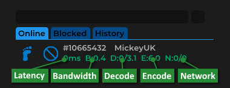

<!-- PROJECT LOGO -->
 

  
  <h3 align="center">Smash Soda</h3>

  

    Open source Parsec Arcade hosting tool
     
    <a href="https://github.com/MickeyUK/SmashSoda/releases">Latest Release</a>
    ·
    <a href="https://github.com/MickeyUK/SmashSoda/issues">Report Bug</a>
    ·
    <a href="https://github.com/MickeyUK/SmashSoda/issues">Request Feature</a>
  

<!-- TABLE OF CONTENTS -->

  
<h2 style="display: inline-block">Table of Contents</h2>

  <ol>
    <li>
      <a href="#about-the-project">About The Project</a>
    </li>
    <li><a href="#features">Features</a></li>
    <li><a href="#chat-commands">Chat Commands</a></li>
    <li><a href="#network-latency">Network Latency</a></li>
    <li><a href="#roadmap">Roadmap</a></li>
    <li><a href="#license">License</a></li>
    <li><a href="#contact">Contact</a></li>
    <li><a href="#acknowledgements">Acknowledgements</a></li>
  </ol>

## About the Project

This is a modification of <a href="https://github.com/FlavioFS/">ParsecSoda</a>, a tool developed by <a href="https://github.com/FlavioFS/">FlavioFS</a> for improving the hosting experience on Parsec Arcade. It builds upon modifications made by user <a href="https://github.com/v6ooo/">v6000</a>.

The aim of this project is to add additional useful features, with a focus on those who wish to host Super Smash Bros Ultimate.

## Features

  * **Ping Limit**
  This allows you to set a latency limit for your lobby. Those whose pings exceed the limit will be kicked automatically.

  * **Moderator System**
  Grant moderator permissions to users you trust in your lobbies. This will allow your mods to kick troublesome users and other admin tier commands.

  * **Themes**
  Check out the new *Midnight* theme for Smash Soda or select from some presets!

## Chat Commands

Below is a list of all the chat commands. Commands new to Smash Soda are highlighted in red.

##### General
|Command|Description|
| ----------- | ----------- |
|!bonk| Bonk another user on the head.
|!discord| If you have set a Discord invite URL set in the Smash Soda configuration settings then this command will print it in chat.
|!help| Show command list.
|!ff| Drop all gamepads you're holding.
|!mirror| Toggle mirroring of L-Stick into DPad.
|!one| Maps all of your devices to the same gamepad.
|!pads| Shows who's holding each gamepad.
|!sfx| Play sound effect.
|!swap| Replace your gamepad with another one.

##### Admin / Moderator
|Command|Description|
| ----------- | ----------- |
|!ban| Ban a guest.
|!bb| Useful for when hosting Smash Bros Ultimate. If people leave on the match results screen, this command will press the B button twice on all gamepads.
|!dc| Disconnect a specific gamepad.
|!kick| Kick user from the room.
|!strip| Strip gamepad from player's hand.
|!limit| Set the maximum amount of pads a guest can hold.
|!ping| Returns the ping for a user.
|!unban| Unban a guest.

##### God
|Command|Description|
| ----------- | ----------- |
|!gameid| Set game ID.
|!guests| Set the amount of room slots.
|!mic| Set the microphone volume.
|!mod| You can make a user in your lobby a moderator. They will then have Admin tier privileges, having access to those commands.
|!name| Set the room name.
|!private| Make the room private.
|!public| Make the room public.
|!q| Close stream.
|!setconfig| Apply config changes.
|!speakers| Set speakers volume.
|!unmod| Revoke moderator permissions.

## Network Latency

When guests join your lobby you will see a set of numbers below their username. These are metrics that measure how good their connection is to you.

|Value|Description|
| ----------- | ----------- |
|**Latency**| Latency (or ping) of guest in milliseconds.
|**Bandwidth**| Maximum rate of data transfer (in Mbps).
|**Decode**| Queued frames/decode latency in milliseconds.
|**Encode**| Host encoding latency in milliseconds.
|**Network**| Slow retransmits/Fast retransmits.

These values will change colour to give you additional information:

|Colour|Description|
| ----------- | ----------- |
|Green| No retransmits in the last 2 seconds.
|Yellow| At least 1 fast retransmit in the last 2 seconds.
|Red| At least 1 slow retransmit in the last 2 seconds.

When guests with high latency join your lobby, it can often ruin the quality of your stream for other guests. You can impose a latency limit in the host settings. Guests exceeding the limit will be automatically kicked.

## Roadmap

See the [open issues](https://github.com/MickeyUK/SmashSoda/issues) for a list of proposed features (and known issues).

## License

See `LICENSE.txt` for more information.

## Contact

Project Link: [https://github.com/MickeyUK/SmashSoda](https://github.com/MickeyUK/SmashSoda)

<!-- ACKNOWLEDGEMENTS -->
## Acknowledgements

* [MickeyUK] - [GitHub](https://github.com/MickeyUK)
* [FlavioFS] - [GitHub](https://github.com/FlavioFS/)
* [v6000] - [GitHub](https://github.com/v6ooo/)
* [R3DPanda] - [GitHub](https://github.com/R3DPanda1/)